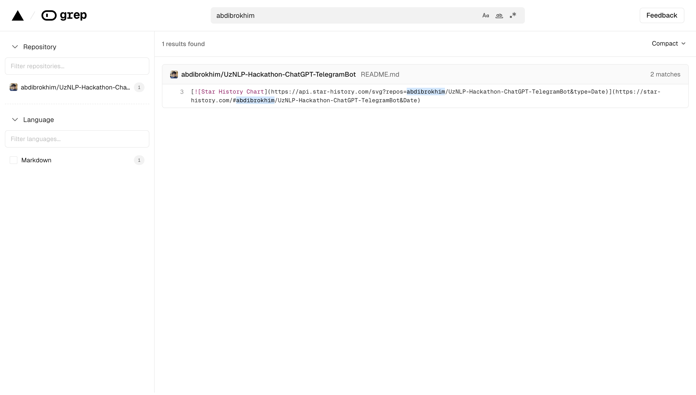
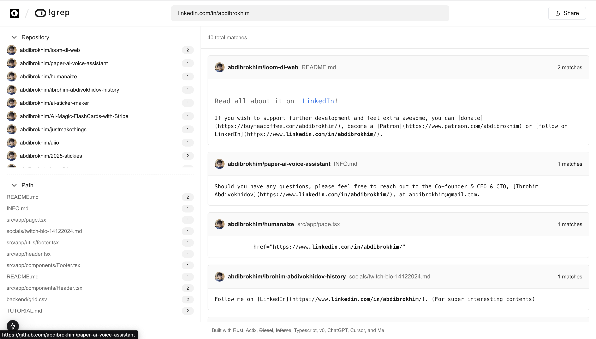

# !grep.app

<div align="center">

[](https://github.com/abdibrokhim/notgrep/issues)
[](LICENSE)


</div>

<p align="center">
  <a href="https://notgrep.app/" rel="noopener">
 </a>

 <h3 align="center"><a href="https://notgrep.app">!grep</a></h3>
  <p align="center">
  this is not grep
    <br />
    <br />
    <a href="https://discord.gg/nUdcd9p8Ae">Join !community</a>
    ·
    <a href="https://www.linkedin.com/in/abdibrokhim/">!documentation</a>
    ·
  </p>
</p>

## About The Project



` grep ` couldn't find my code, so I just made ` !grep `.



` !grep ` is a search engine for code. It's a tool that allows you to search for code snippets in my repositories on GitHub. It's like ` grep `, but not ` grep `. lol


## Why's it called ` !grep `?

Because it's not ` grep `. jkjkj

## Built With
- [Rust](https://www.rust-lang.org/)
- [Actix](https://actix.rs/)
- ~~[Diesel](http://diesel.rs/)~~ (coming soon)
- ~~[Inferno](https://infernojs.org/)~~ (coming soon)
- [Typescript](https://www.typescriptlang.org/)
- [v0](https://v0.dev/)
- [ChatGPT](https://chatgpt.com/)
- [Cursor](https://cursor.com/)
- [IA](https://ia.com/)

## Features

- All the features that actual ` grep.app ` has, plus couldn't make. lol

## Run Locally

Clone the repository:

```shell
git clone https://github.com/abdibrokhim/notgrep.git
```

Install the dependencies with:

```shell
cargo install
```

Copy the `.env.example` file to `.env`:

```shell
cp .env.example .env
```

Replace with your stuff:
    
```shell
GITHUB_TOKEN=ghp_... # your GitHub token. Get it from: https://github.com/settings/tokens
TEST_MODE=true/false # depending on the environment
```

Run the development server with:

```shell
cargo run
```

Send request here: [http://localhost:8080](http://localhost:8080). You may try to run the tests with:

```shell
cargo test
```

## Open Community Projects

- [Open Community - a new kind of community to learn things](https://www.imcook.in/OpenCommunity)

## Donate & Support

- [Support on Open Collective](https://opencollective.com/opencommunity)

### Crypto
- Bitcoin: bc1qpylxaqwapk0tgdmpnnljj545z4lk2z9q5us6p6
- Ethereum: 0xb4a8e71d82e8Bf84a02C7770585F9cD8b267aDB9
- Solana: 4MpPHapcdb5MwRy57juUQ2wUt1EJo8BYqXsYKwSfCvz1

You can also find them here: [my official website](https://imcook.in) (scroll a lil below)

## Contributing

You can just Contribute. Kindly check the [CONTRIBUTING.md](https://github.com/abdibrokhim/notgrep/blob/main/CONTRIBUTING.md)

## Community

Join community on [Discord](https://discord.gg/nUdcd9p8Ae)

## Star History

[](https://star-history.com/#abdibrokhim/notgrep&Date)

Put a star or ~~die~~! ✨

## Credits

Logo made (~~shitcopied~~) by Ibrohim Abdivokhidov (@abdibrokhim) under the OC-IA 1.0 license. Follow him on [LinkedIn](https://www.linkedin.com/in/abdibrokhim/) and/ or [X (twitter)](https://twitter.com/abdibrokhim)